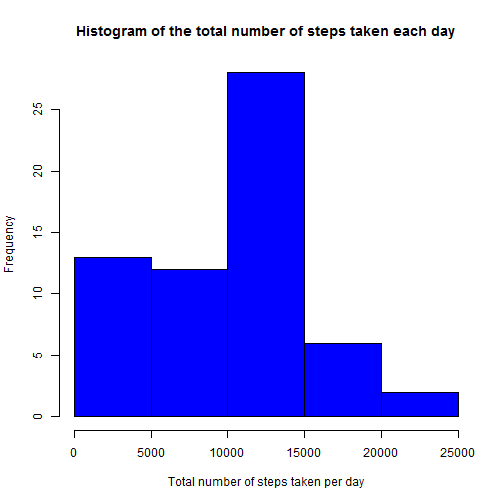
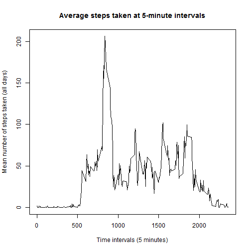
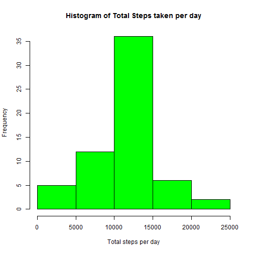

# Reproducible Research: Peer Assessment 1

It is now possible to collect a large amount of data about personal movement using activity monitoring devices such as a Fitbit, Nike Fuelband, or Jawbone Up. These type of devices are part of the "quantified self" movement - a group of enthusiasts who take measurements about themselves regularly to improve their health, to find patterns in their behavior, or because they are tech geeks. But these data remain under-utilized both because the raw data are hard to obtain and there is a lack of statistical methods and software for processing and interpreting the data.

This assignment makes use of data from a personal activity monitoring device. This device collects data at 5 minute intervals through out the day. The data consists of two months of data from an anonymous individual collected during the months of October and November, 2012 and include the number of steps taken in 5 minute intervals each day.

## The Data

The dataset for this assignment can be found in this repository as *activity.zip*.

The variables included in this dataset are:

- steps: Number of steps taking in a 5-minute interval (missing values are coded as NA).

- date: The date on which the measurement was taken in YYYY-MM-DD format.

- interval: Identifier for the 5-minute interval in which measurement was taken.

## Loading and preprocessing the data


```r
echo=TRUE
setwd("C:/Users/Gaby/Documents/RepData_PeerAssessment1")
library(lattice)
```

1. Load the data


```r
unzip("activity.zip")
data <- read.csv("activity.csv",
                 header=TRUE,
                 na.strings="NA")
head(data)
```

```
##   steps       date interval
## 1    NA 2012-10-01        0
## 2    NA 2012-10-01        5
## 3    NA 2012-10-01       10
## 4    NA 2012-10-01       15
## 5    NA 2012-10-01       20
## 6    NA 2012-10-01       25
```
                 

```r
tail(data)
```

```
##       steps       date interval
## 17563    NA 2012-11-30     2330
## 17564    NA 2012-11-30     2335
## 17565    NA 2012-11-30     2340
## 17566    NA 2012-11-30     2345
## 17567    NA 2012-11-30     2350
## 17568    NA 2012-11-30     2355
```

2. Process/transform the data (if necessary) into a format suitable for your analysis.


```r
class(data$date)
```

```
## [1] "factor"
```


```r
data$date <- as.Date(data$date)
class(data$date)
```

```
## [1] "Date"
```


## What is mean total number of steps taken per day?

1. Calculate the total number of steps taken per day.


```r
total_steps <- tapply(data$steps, data$date, FUN=sum, na.rm=TRUE)
```

2. Make a histogram of the total number of steps taken each day.


```r
hist(total_steps, 
     col="blue",
     xlab="Total number of steps taken per day",
     ylab="Frequency",
     main="Histogram of the total number of steps taken each day")
```

 

3. Calculate and report the mean and median of the total number of steps taken per day.


```r
Mean <- mean(total_steps, na.rm=TRUE)
Mean
```

```
## [1] 9354.23
```


```r
Median <- median(total_steps, na.rm=TRUE)
Median
```

```
## [1] 10395
```

On average, 9354 steps are taken per day. And the median is 10395.

## What is the average daily activity pattern?

1. Make a time series plot of the 5-minute interval (x-axis) and the average number of steps taken, averaged across all days (y-axis).


```r
meanSteps <- tapply(data$steps,
                    data$interval,
                    mean, na.rm=TRUE)
plot(row.names(meanSteps), 
     meanSteps,
     type = "l",
     xlab = "Time intervals (5 minutes)",
     ylab = "Mean number of steps taken (all days)",
     main = "Average steps taken at 5-minute intervals")
```

 

2. Which 5-minute interval, on average across all the days in the dataset, contains the maximum number of steps?


```r
interval_num <- which.max(meanSteps)
interval_maxSteps <- names(interval_num)
interval_maxSteps
```

```
## [1] "835"
```


The corresponding 5-minute interval identifier is 835.

## Imputing missing values

1. Calculate and report the total number of missing values in the dataset (i.e. the total number of rows with NAs).


```r
totalNA <- sum(is.na(data))
totalNA
```

```
## [1] 2304
```

2. Devise a strategy for filling in all of the missing values in the dataset. The strategy does not need to be sophisticated. For example, you could use the mean/median for that day, or the mean for that 5-minute interval, etc.

3.Create a new dataset that is equal to the original dataset but with the missing data filled in.

(Question 2 and 3 will be answerd in the same code chunk)


```r
na_indices <-  which(is.na(data))

imputed_values <- meanSteps[as.character(data[na_indices,3])]

names(imputed_values) <- na_indices
for (i in na_indices) {
    data$steps[i] = imputed_values[as.character(i)]
}
new.data <- data
sum(is.na(new.data))
```

```
## [1] 0
```

4. Make a histogram of the total number of steps taken each day and Calculate and report the mean and median total number of steps taken per day. Do these values differ from the estimates from the first part of the assignment? What is the impact of imputing missing data on the estimates of the total daily number of steps?


```r
totsteps <- tapply(new.data$steps, new.data$date, sum)
hist(totsteps, col= "green",
     xlab="Total steps per day",
     ylab="Frequency",
     main="Histogram of Total Steps taken per day")
```

 

## Are there differences in activity patterns between weekdays and weekends?

1. Create a new factor variable in the dataset with two levels - "weekday" and "weekend" indicating whether a given date is a weekday or weekend day.


```r
new.data$date <- as.Date(new.data$date)
new.data$weekdays <- factor(format(new.data$date, "%A"))
levels(new.data$weekdays) <- list(weekday = c("Monday", "Tuesday", "Wednesday", "Thursday", "Friday"), weekend = c("Saturday", "Sunday"))
head(new.data)
```

```
##       steps       date interval weekdays
## 1 1.7169811 2012-10-01        0  weekday
## 2 0.3396226 2012-10-01        5  weekday
## 3 0.1320755 2012-10-01       10  weekday
## 4 0.1509434 2012-10-01       15  weekday
## 5 0.0754717 2012-10-01       20  weekday
## 6 2.0943396 2012-10-01       25  weekday
```


```r
tail(new.data)
```

```
##           steps       date interval weekdays
## 17563 2.6037736 2012-11-30     2330  weekday
## 17564 4.6981132 2012-11-30     2335  weekday
## 17565 3.3018868 2012-11-30     2340  weekday
## 17566 0.6415094 2012-11-30     2345  weekday
## 17567 0.2264151 2012-11-30     2350  weekday
## 17568 1.0754717 2012-11-30     2355  weekday
```

2. Make a panel plot containing a time series plot (i.e. type = "l") of the 5-minute interval (x-axis) and the average number of steps taken, averaged across all weekday days or weekend days (y-axis). See the README file in the GitHub repository to see an example of what this plot should look like using simulated data.


```r
av <- aggregate(steps ~ interval + weekdays, data=new.data, mean)
xyplot(av$steps ~ av$interval | av$weekdays, 
       layout=c(1, 2),
       type="l",
       xlab="Interval",
       ylab="Number of steps")
```

 

